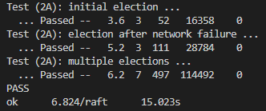
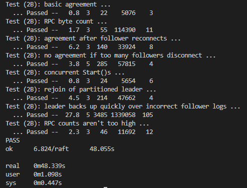
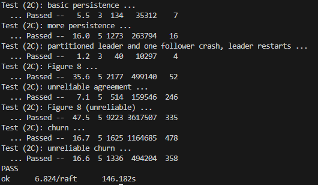
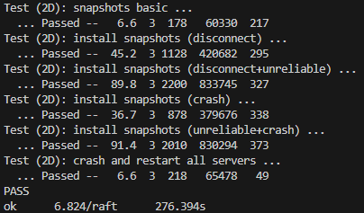

## MIT6.824 2022 Lab2

* [x] 2A
* [x] 2B
* [x] 2C
* [x] 2D


测试结果

* 2A
  


* 2B



* 2C



* 2D



## Part A：领导人选举

2A是比较简单的，只需要完成领导人选举就可以

我的ticker设计如下

```go
func (rf *Raft) ticker() {
	var sleepTime time.Duration //间隔时间，取决于当前状态
	for !rf.killed() {
		rf.mu.Lock()
		if rf.isLeader { //是领导者，发送心跳包，且将间隔时间设置成心跳间隔
			rf.sendHeartBeatToFollowers()
			sleepTime = HEARTBEAT_INTERVAL
		} else {
			if time.Now().UnixMilli()-rf.lastHeartBeatTime > HEARTBEAT_TIMEOUT.Milliseconds() { //领导者心跳超时，发动新选举
				if rf.startNewElection() { //选举成功，将间隔时间设置成0，立即开始心跳
					sleepTime = 0
				} else { //等待选举超时
					sleepTime = time.Duration(rand.Intn(200)+int(ELECTION_TIMEOUT.Milliseconds())) * time.Millisecond
				}
			} else { //否则等下次检测领导者超时
				sleepTime = LEADER_TIMEOUT_CHECK_INTERVAL
			}
		}
		rf.mu.Unlock()
		rf.persist()
		time.Sleep(sleepTime)
	}
}
```

按照我这种设计方式，有个问题需要注意，就是关于rpc的死锁和rpc失败的问题

rpc死锁有可能发生的情况是，A上了A锁，通过rpc调用B的RequestVote函数，同时B上了B锁，通过rpc调用A的RequestVote函数，但是B的RequestVote里面需要上B锁，A的RequestVote里面需要上A锁，因此形成死锁

rpc失败顾名思义，假如服务器宕机了，通过rpc调用该服务器就会阻塞一段时间

这两种问题都会导致选举超时或者附加日志超时

解决的方法很简单，即将rpc调用通过go协程模拟成异步的形式

大致代码如下：

```go
声明一些变量用来存储rpc调用的结果

for 遍历所有服务器{
	开启一个go协程，进行该对象的rpc调用
}

等待一段时间

for 遍历所有结果{
	处理所有结果
}
```

## Part B：日志（困难）

需要附加日志，添加一个循环，用来发送AppendEntries rpc

```go
// 发送AE的循环
func (rf *Raft) ticker2() {
	for !rf.killed() {
		rf.mu.Lock()
		if rf.isLeader {
			rf.sendAEToFollowers()
		}
		rf.mu.Unlock()
		rf.persist()
		time.Sleep(APPENDENTRIES_INTERVAL)
	}

```

注意领导人的选举条件与PartA有所不同

## Part C：持久化（困难）

需求其实很简单，就是调用rf.persister.SaveRaftState()函数来保存快照

并在启动时通过rf.persister.ReadRaftState()读取

注意，这两个函数都是保存的[]byte，所以我们需要自己实现将rf转换成[]byte

以下是我设计的persist()函数，用来进行持久化，

```go
func (rf *Raft) persist() {
	rf.mu.Lock()
	defer rf.mu.Unlock()

	rf.persister.SaveRaftState(rf.persistData())
}

func (rf *Raft) persistData() []byte {
	w := new(bytes.Buffer)
	e := labgob.NewEncoder(w)

	state := &RaftState{
		IsLeader:          rf.isLeader,
		CurrentTerm:       rf.currentTerm,
		VotedFor:          rf.votedFor,
		Log:               append([]Log(nil), rf.log...),
		CommitIndex:       rf.commitIndex,
		LastApplied:       rf.lastApplied,
		LeaderId:          rf.leaderId,
		NextIndex:         append([]int(nil), rf.nextIndex...),
		MatchIndex:        append([]int(nil), rf.matchIndex...),
		TotalAccept:       append([]int(nil), rf.totalAccept...),
		LastHeartBeatTime: rf.lastHeartBeatTime,
		LastIncludeIndex:  rf.lastIncludeIndex,
		LastIncludeTerm:   rf.lastIncludeTerm,
	}

	if err := e.Encode(state); err != nil {
		log.Fatalf("failed to encode state: %v", err)
	}

	return w.Bytes()
}

func (rf *Raft) readPersist(data []byte) {
	if data == nil || len(data) < 1 { // bootstrap without any state?
		return
	}

	r := bytes.NewBuffer(data)
	d := labgob.NewDecoder(r)

	state := &RaftState{}

	if err := d.Decode(state); err != nil {
		log.Fatalf("failed to decode state: %v", err)
	}

	rf.isLeader = state.IsLeader
	rf.currentTerm = state.CurrentTerm
	rf.votedFor = state.VotedFor
	rf.log = state.Log
	rf.commitIndex = state.CommitIndex
	rf.lastApplied = state.LastIncludeIndex
	rf.leaderId = state.LeaderId
	rf.nextIndex = state.NextIndex
	rf.matchIndex = state.MatchIndex
	rf.totalAccept = state.TotalAccept
	rf.lastHeartBeatTime = state.LastHeartBeatTime
	rf.lastIncludeIndex = state.LastIncludeIndex
	rf.lastIncludeTerm = state.LastIncludeTerm
}
```

我在每一个加锁的区间判断，这个区间内是否可能会对rf的数据进行修改，如果可能，则在锁释放后立即调用rf.persist()

## Part D：日志压缩（困难）

我认为这部分最难的在于理解

首先在服务器运行的过程中，测试程序觉得某个服务器某些已经提交的日志不会再用了，他就会将日志压缩成快照，并调用rf.SnapShot()告诉服务器，我已经帮你将快照做好了，你需要裁剪日志

如果某个刚重连的服务器，缺少的部分太靠前，导致领导者的这部分日志已经变成快照，则领导者不再发AppendEntries给该服务器，而是改发InstallSnapShot(),当然这个得我们自己实现，然后跟随者接收到这部分后，将其设置为自己的快照，并将本来用日志进行的提交改为用快照提交，相当于交了  1~快照大小 这部分的日志

至于CondInstallSnapshot(),它已经被弃用，我们可以置之不理

有一个注意的点，如果一个服务器宕机并重启，他的LastApplied属性一定要设置成lastIncludeIndex，不然测试会失败

```go
// 该服务表示它已经创建了一个快照，其中包含索引之前的所有信息（包括索引）。 这意味着服务不再需要通过（并包括）该索引的日志。 Raft 现在应该尽可能地修剪其日志。
func (rf *Raft) Snapshot(index int, snapshot []byte) {
	// Your code here (2D).
	rf.mu.Lock()
	defer rf.persist()
	rf.mu.Unlock()
	if rf.lastIncludeIndex >= index || index > rf.commitIndex {
		return
	}
	rf.lastIncludeTerm = rf.log[index-rf.lastIncludeIndex-1].Term
	rf.log = rf.log[index-rf.lastIncludeIndex:]
	rf.snapshot = snapshot
	rf.lastIncludeIndex = index

	rf.persister.SaveStateAndSnapshot(rf.persistData(), snapshot)
}

type InstallSnapshotArgs struct {
	Term             int    // 领导人的任期号
	LeaderId         int    // 领导人的 ID，以便于跟随者重定向请求
	LastIncludeIndex int    // 快照中包含的最后日志条目的索引值
	LastIncludeTerm  int    // 快照中包含的最后日志条目的任期号
	Data             []byte // 快照分块的原始字节
}

type InstallSnapshotReply struct {
	Term int // 当前任期号（currentTerm），便于领导人更新自己
}

func (rf *Raft) sendInstallSnapShot(server int, args *InstallSnapshotArgs, reply *InstallSnapshotReply) bool {
	ok := rf.peers[server].Call("Raft.InstallSnapShot", args, reply)
	return ok
}

func (rf *Raft) InstallSnapShot(args *InstallSnapshotArgs, reply *InstallSnapshotReply) {
	rf.mu.Lock()
	defer rf.persist()
	defer rf.mu.Unlock()

	if args.Term < rf.currentTerm { //请求的任期号小于当前任期号，过期的请求
		reply.Term = rf.currentTerm
		return
	}

	if args.Term > rf.currentTerm { //请求的任期号大于当前任期号，更新当前的任期
		rf.updateTerm(args.Term)
	}

	rf.lastHeartBeatTime = time.Now().UnixMilli()
	rf.leaderId = args.LeaderId
	rf.isLeader = false

	rf.snapshot = args.Data
	rf.lastIncludeTerm = args.LastIncludeTerm
	rf.lastIncludeIndex = args.LastIncludeIndex

	rf.log = make([]Log, 0)

	rf.persister.SaveStateAndSnapshot(rf.persistData(), args.Data)
	//fmt.Printf("server: %v, snap, index: %v\n", rf.me, rf.lastIncludeIndex)
	rf.applyChannal <- ApplyMsg{
		SnapshotValid: true,
		Snapshot:      rf.snapshot,
		SnapshotTerm:  rf.lastIncludeTerm,
		SnapshotIndex: rf.lastIncludeIndex,
	}

	rf.lastApplied = rf.lastIncludeIndex

	rf.commitIndex = rf.lastIncludeIndex

	reply.Term = rf.currentTerm
}
```
